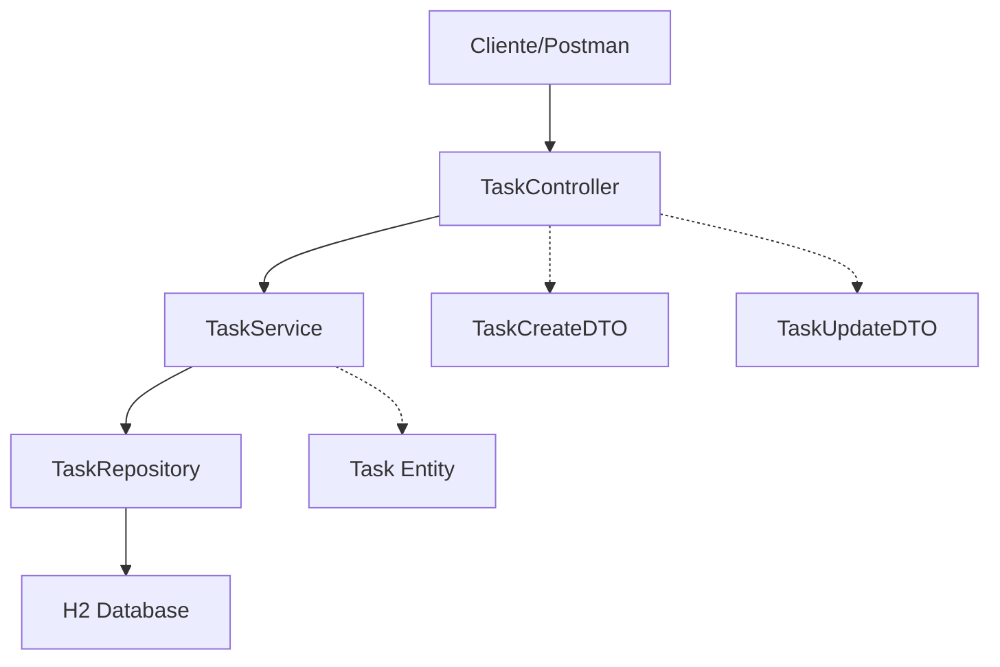

# 📋 Todo List API - Spring Boot

[](https://www.oracle.com/java/)
[](https://spring.io/projects/spring-boot)
[](https://maven.apache.org/)
[](LICENSE)

> **API REST profesional para gestión de tareas** construida con Spring Boot 3.x. Proyecto diseñado como referencia de **arquitectura limpia** y **mejores prácticas** para desarrollo backend, ideal para **pruebas técnicas** y **portafolio profesional**.

---

## 🌟 Características Principales

- ✅ **CRUD Completo**: Crear, leer, actualizar y eliminar tareas
- 🔒 **Validaciones Robustas**: Bean Validation con mensajes personalizados
- 🏗️ **Arquitectura en Capas**: Controller → Service → Repository → Database
- 💾 **Base de Datos**: H2 en memoria con datos de prueba incluidos
- 📦 **DTOs**: Transferencia segura de datos con validaciones específicas
- 🎯 **RESTful Design**: Endpoints que siguen estándares REST
- 📝 **Logging Estructurado**: Trazabilidad completa de operaciones
- 🔄 **Transacciones**: Manejo automático con Spring `@Transactional`
- 🕐 **Auditoría**: Timestamps automáticos de creación y actualización

---

## 🛠️ Stack Tecnológico

| Tecnología | Versión | Propósito |
|------------|---------|-----------|
| **Java** | 17 LTS | Lenguaje de programación |
| **Spring Boot** | 3.2.5 | Framework principal |
| **Spring Data JPA** | Incluida | ORM y acceso a datos |
| **H2 Database** | Incluida | Base de datos en memoria |
| **Lombok** | Incluida | Reducción de código boilerplate |
| **Bean Validation** | Incluida | Validaciones declarativas |
| **Maven** | 3.9+ | Gestión de dependencias |

---

## 📁 Estructura del Proyecto

```
src/main/java/com/example/todoapi/
├── 🚀 TodoApiApplication.java          # Clase principal
├── 🌐 controller/
│   └── TaskController.java             # Controlador REST
├── 📋 service/
│   ├── TaskService.java                # Interface del servicio
│   └── TaskServiceImpl.java            # Implementación del servicio
├── 🗄️ repository/
│   └── TaskRepository.java             # Acceso a datos JPA
├── 📦 dto/
│   ├── TaskCreateDTO.java              # DTO para creación
│   └── TaskUpdateDTO.java              # DTO para actualización
└── 🏷️ model/
    └── Task.java                       # Entidad JPA

src/main/resources/
├── 📄 application.yml                  # Configuración
└── 📊 data.sql                         # Datos de prueba
```

---

## 🚀 Inicio Rápido

### Prerrequisitos

- **Java 17** o superior ([Descargar](https://adoptium.net/))
- **Maven 3.6+** (incluido con el proyecto via wrapper)

### Instalación y Ejecución

```bash
# 1. Clonar el repositorio
git clone https://github.com/tu-usuario/todo-list-api.git
cd todo-list-api

# 2. Ejecutar la aplicación
./mvnw spring-boot:run

# 3. La aplicación estará disponible en:
# 🌐 API: http://localhost:8080/api/v1/tasks
# 🗄️ H2 Console: http://localhost:8080/h2-console
```

### Configuración de H2 Console

Para acceder a la base de datos:

- **URL**: `http://localhost:8080/h2-console`
- **JDBC URL**: `jdbc:h2:mem:testdb`
- **Usuario**: `sa`
- **Contraseña**: `password`

---

## 📋 API Endpoints

### Resumen de Endpoints

| Método | Endpoint | Descripción |
|--------|----------|-------------|
| `GET` | `/api/v1/tasks` | Obtener todas las tareas |
| `GET` | `/api/v1/tasks/{id}` | Obtener tarea por ID |
| `GET` | `/api/v1/tasks?estado=PENDIENTE` | Filtrar por estado |
| `POST` | `/api/v1/tasks` | Crear nueva tarea |
| `PUT` | `/api/v1/tasks/{id}` | Actualizar tarea completa |
| `PATCH` | `/api/v1/tasks/{id}/estado` | Cambiar solo el estado |
| `DELETE` | `/api/v1/tasks/{id}` | Eliminar tarea |

### Ejemplos de Uso

<details>
<summary><strong>📄 Ver todos los ejemplos de cURL</strong></summary>

#### 1. Obtener todas las tareas
```bash
curl -X GET http://localhost:8080/api/v1/tasks
```

**Respuesta:**
```json
[
  {
    "id": 1,
    "titulo": "Estudiar Spring Boot",
    "descripcion": "Repasar conceptos para entrevista",
    "estado": "PENDIENTE",
    "fechaCreacion": "2024-01-15T10:30:00",
    "fechaActualizacion": "2024-01-15T10:30:00"
  }
]
```

#### 2. Crear nueva tarea
```bash
curl -X POST http://localhost:8080/api/v1/tasks \
  -H "Content-Type: application/json" \
  -d '{
    "titulo": "Preparar presentación",
    "descripcion": "Slides para demo del proyecto"
  }'
```

**Respuesta:** `201 Created`
```json
{
  "id": 2,
  "titulo": "Preparar presentación",
  "descripcion": "Slides para demo del proyecto",
  "estado": "PENDIENTE",
  "fechaCreacion": "2024-01-15T11:00:00",
  "fechaActualizacion": "2024-01-15T11:00:00"
}
```

#### 3. Actualizar tarea completa
```bash
curl -X PUT http://localhost:8080/api/v1/tasks/1 \
  -H "Content-Type: application/json" \
  -d '{
    "titulo": "Estudiar Spring Boot - Avanzado",
    "descripcion": "Incluir Spring Security y Testing",
    "estado": "COMPLETADA"
  }'
```

#### 4. Cambiar solo el estado
```bash
curl -X PATCH http://localhost:8080/api/v1/tasks/1/estado \
  -H "Content-Type: application/json" \
  -d '{"estado": "COMPLETADA"}'
```

#### 5. Filtrar por estado
```bash
curl -X GET "http://localhost:8080/api/v1/tasks?estado=PENDIENTE"
```

#### 6. Eliminar tarea
```bash
curl -X DELETE http://localhost:8080/api/v1/tasks/1
```
**Respuesta:** `204 No Content`

</details>

---

## 🏗️ Arquitectura y Patrones

### Arquitectura en Capas



### Patrones Implementados

- 🏗️ **Dependency Injection**: Inversión de control con Spring
- 📦 **DTO Pattern**: Transferencia segura de datos
- 🗄️ **Repository Pattern**: Abstracción del acceso a datos
- 🔄 **Service Layer**: Encapsulación de lógica de negocio
- ✅ **Validation Pattern**: Validaciones declarativas

### Validaciones Multi-nivel

```java
// 1. Validación Java (Bean Validation)
@NotBlank(message = "El título no puede estar vacío")
@Size(min = 1, max = 100, message = "El título debe tener entre 1 y 100 caracteres")

// 2. Validación JPA (Base de datos)
@Column(nullable = false, length = 100)

// 3. Validación en Controller
@Valid @RequestBody TaskCreateDTO dto
```

---

## 🧪 Testing

### Ejecutar Tests
```bash
# Ejecutar todos los tests
./mvnw test

# Ejecutar con reportes detallados
./mvnw test -Dmaven.test.failure.ignore=true

# Generar reporte de cobertura (si tienes JaCoCo configurado)
./mvnw jacoco:report
```

### Probar con Postman

1. **Importar Collection**: [Descargar colección de Postman](docs/Todo-API.postman_collection.json)
2. **Environment**: Configurar `baseUrl = http://localhost:8080`
3. **Ejecutar Tests**: Probar todos los endpoints automáticamente

---

## 📊 Características Técnicas Destacadas

### 🔒 Validaciones Robustas
- **Bean Validation** con mensajes personalizados
- **Validación en múltiples capas** (DTO, Entity, Database)
- **Manejo de errores** con códigos HTTP apropiados

### 📝 Logging y Auditoría
```java
@Slf4j
@Service
public class TaskServiceImpl {
    public Task crearTarea(TaskCreateDTO dto) {
        log.debug("Creando nueva tarea: {}", dto.getTitulo());
        // ... lógica
        log.info("Tarea creada exitosamente con ID: {}", task.getId());
        return task;
    }
}
```

### 🕐 Timestamps Automáticos
- **@CreationTimestamp**: Fecha de creación automática
- **@UpdateTimestamp**: Fecha de actualización automática
- **Auditoría completa** sin código adicional

### 🔄 Transacciones
- **@Transactional** en capa de servicio
- **Rollback automático** en caso de errores
- **Consistencia de datos** garantizada

---

## 🚀 Construcción y Deployment

### Build del Proyecto
```bash
# Compilar
./mvnw compile

# Empaquetar (genera JAR)
./mvnw package

# Limpiar y empaquetar
./mvnw clean package
```

### Ejecutar JAR
```bash
# Ejecutar el JAR generado
java -jar target/todo-api-0.0.1-SNAPSHOT.jar

# Con perfil específico
java -jar target/todo-api-0.0.1-SNAPSHOT.jar --spring.profiles.active=prod
```

### Docker (Opcional)
```dockerfile
FROM openjdk:17-jdk-slim
COPY target/todo-api-0.0.1-SNAPSHOT.jar app.jar
EXPOSE 8080
ENTRYPOINT ["java","-jar","/app.jar"]
```

```bash
# Construir imagen
docker build -t todo-api .

# Ejecutar contenedor
docker run -p 8080:8080 todo-api
```

---

## 🎯 Casos de Uso Empresariales

Este proyecto demuestra patrones y prácticas aplicables en:

- 🏦 **Fintech**: Sistemas de transacciones y pagos
- 🛒 **E-commerce**: Gestión de pedidos y productos
- 🏥 **Healthcare**: Sistemas de citas y pacientes
- 📚 **Education**: Plataformas de cursos y estudiantes
- 🏢 **Enterprise**: Aplicaciones internas de gestión

---

## 🔧 Configuración Avanzada

### Profiles de Spring
```yaml
# application-dev.yml
spring:
  jpa:
    show-sql: true
  logging:
    level:
      com.example.todoapi: DEBUG

# application-prod.yml
spring:
  jpa:
    show-sql: false
  logging:
    level:
      com.example.todoapi: INFO
```

### Variables de Entorno
```bash
# Configurar puerto
export SERVER_PORT=8090

# Configurar base de datos
export SPRING_DATASOURCE_URL=jdbc:postgresql://localhost:5432/todoapp
export SPRING_DATASOURCE_USERNAME=admin
export SPRING_DATASOURCE_PASSWORD=password
```

---

## 📈 Posibles Mejoras

- [ ] **Autenticación**: Spring Security con JWT
- [ ] **Paginación**: Para grandes volúmenes de datos
- [ ] **Cache**: Redis para optimizar consultas
- [ ] **Documentación**: Swagger/OpenAPI 3.0
- [ ] **Testing**: Tests unitarios y de integración
- [ ] **Observabilidad**: Métricas con Micrometer
- [ ] **Base de datos**: PostgreSQL para producción
- [ ] **CI/CD**: GitHub Actions o Jenkins

---

## 📚 Recursos y Referencias

- [Spring Boot Documentation](https://spring.io/projects/spring-boot)
- [Spring Data JPA Reference](https://spring.io/projects/spring-data-jpa)
- [Bean Validation Specification](https://beanvalidation.org/)
- [REST API Best Practices](https://restfulapi.net/)

---

## 🤝 Contribución

1. **Fork** el proyecto
2. **Crea** tu rama de feature (`git checkout -b feature/nueva-caracteristica`)
3. **Commit** tus cambios (`git commit -am 'Agregar nueva característica'`)
4. **Push** a la rama (`git push origin feature/nueva-caracteristica`)
5. **Abre** un Pull Request

---

## 📄 Licencia

Este proyecto está bajo la Licencia MIT - ver el archivo [LICENSE](LICENSE) para detalles.

---

## 👨‍💻 Autor

**Isaac Sarceño**
- Email: isaac.flores.dev@gmail.com

---

<div align="center">

### ⭐ ¡Si te gusta este proyecto, dale una estrella!

**Hecho con ❤️ y Spring Boot**

</div>
